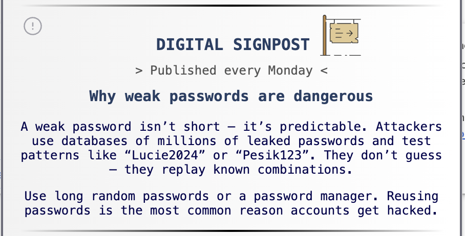

# HackMindset – Chrome Extension  
A privacy-friendly daily knowledge companion that turns mindless scrolling into meaningful moments.


**Live Extension:** *(coming soon)*  
**Repository:** https://github.com/GrutifulDay/HackMindset  

---

## 💡 Overview  
HackMindset delivers small, meaningful pieces of knowledge that replace algorithm-driven noise with calm, inspiring content.  
Every day, the extension brings insight from astronomy, history and digital culture — without tracking, ads or personal data collection.

The project also serves as a fullstack security sandbox: JWT handling, rate limiting, anomaly detection, IP reputation logic, OpenResty network filtering and multi-layered API protection.

---

## 🌟 Features

### 🌌 NASA – Astronomy Picture of the Day


A daily view into space using NASA’s official APOD image and description.  
A calm science moment embedded directly in your browser.

### 🧭 Digitální rozcestník (Digital Signpost)


A **daily** educational card explaining modern digital topics:  
algorithms, privacy, AI behaviour, online identity, social media patterns and more.  
Clear and practical guidance for navigating today’s digital world.

### 📜 Story of the Day


A true historical event connected to today’s date, always beginning with:

- **CZ:** „Dnes, ale v roce…“  
- **EN:** „Today, back in the year…“

Short, accurate and memorable — a small daily connection to history.

### 🕹 Retro Machine


A nostalgic journey through technological evolution from the 70s to today:  
old computers, devices, media formats, operating systems and iconic sounds.

### 📸 Moje Insta tipy (Inspiration Profiles)


Curated Instagram recommendations from fields such as space, nature, science and technology.  
A way to “hack your feed” and replace noise with meaningful content.

---

## 🎞 Interaction Preview  


---

## 🛡 Security Architecture (Backend & Network)

HackMindset is built with a layered defensive model suitable for real-world hardening.

### **API Protection**
- JWT authentication (5-minute expiry)  
- JTI-based token revocation  
- Abuse detection with Discord alerts  
- Origin + User-Agent validation  
- Restricted API exposure  

### **Request Filtering & Middleware**
- Adaptive rate limiting (soft + hard)  
- Bot/User-Agent filtering  
- IP blacklist (auto-updated on anomalies)  
- Custom CORS validation  
- Header filtering & sanitization  
- Private endpoint (`/_sec-log`) used for internal security telemetry  
  and future honeypoint communication.

### **Network & Infrastructure**
- OpenResty (NGINX) reverse proxy  
- Hardened security headers (CSP via Helmet, no duplicates)  
- GeoIP-ready filtering  
- Invalid host protection (`return 444`)  
- UFW firewall (80/443/SSH)  
- Fail2Ban for SSH  
- SSH hardening (ed25519 keys, custom port, key-only login)

---

## 🎨 Frontend (Chrome Extension)

- Vanilla JS with **component-like architecture**  
- Separation of popup / content script / background worker  
- Multi-language support (CZ / EN)  
- Time-based caching shared across all sections  
- Tooltip UI system  
- Sound trigger module  
- JetBrains Mono typography & soft rounded UI  
- Strict permissions: no cookies, no remote scripts, no tracking  

---

## 🛠 Backend (Node.js + Express)

- Modular architecture (controllers, routes, services)  
- MongoDB (Mongoose)  
- JWT authentication with revocation  
- Daily cron refresh at **00:01**  
- Structured anomaly and attack logging  
- Discord notifications for suspicious activity  

---

## 🏗 Server & Deployment

- Ubuntu 22.04 VPS  
- OpenResty reverse proxy  
- HTTPS configuration with hardened headers  
- UFW firewall + Fail2Ban  
- Honeypoint architecture prepared for future testing  

---

## 🔧 Chrome Extension Setup (Developer Mode)

To run the extension locally:

1. Open **chrome://extensions/** in your browser.  
2. Enable **Developer Mode** (top-right corner).  
3. Click **Load unpacked**.  
4. Select the **frontend** folder (the directory containing `manifest.json`).  
5. The extension will appear under the puzzle icon (Extensions).  
6. Pin **HackMindset** for easy access.  
7. Click the icon to launch the extension.

---

## 🔧 Backend Setup

```bash
git clone https://github.com/GrutifulDay/HackMindset.git
cd HackMindset/backend
npm install
node server.js
